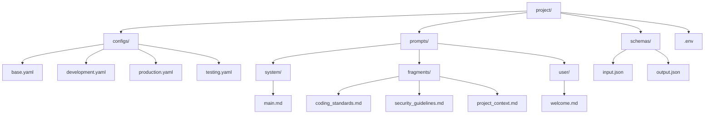

# Agent Configuration

Gola agents are configured through YAML files. Here's everything you need to know about setting up an agent, from basic behavior to complex tool integrations.

## Configuration Structure

Here's what a typical config looks like:

```yaml
agent:          # Agent identity and behavior
  name: string
  description: string
  max_steps: number
  behavior: object
  schema: object

llm:            # Language model configuration
  provider: string
  model: string
  parameters: object
  auth: object

prompts:        # Prompt engineering system
  fragments: object
  roles: object
  purposes: object

mcp_servers:    # External tool integration
  - name: string
    command: object
    tools: array
    enabled: boolean

rag:            # Knowledge base integration (optional)
  enabled: boolean
  embeddings: object
  text_processing: object
  vector_store: object
  document_sources: array
  retrieval: object
  embedding_cache: object

tools:          # Built-in tools (optional)
  calculator: boolean
  web_search: object

environment:    # Environment variables and secrets
  variables: object
  env_files: array
  load_system_env: boolean

logging:        # Logging configuration
  level: string
  format: string
  file: path
  colored: boolean
```

## Agent Configuration

The `agent` section sets up your agent's identity and basic behavior:

```yaml
agent:
  name: "Development Assistant"
  description: "A helpful coding assistant with access to development tools"
  max_steps: 15
  behavior:
    memory:
      max_history_steps: 20
      eviction_strategy: "intelligent"
      preserve_strategy:
        preserve_initial_task: true
      min_recent_steps: 5
    verbose: false
    show_reasoning: false
    tool_timeout: 30
    continue_on_error: true
```

### Behavior Settings

These control how your agent operates:

| Setting | Type | Default | Description |
|---------|------|---------|-------------|
| `verbose` | boolean | false | Enable detailed execution logging |
| `show_reasoning` | boolean | false | Show agent's reasoning process |
| `tool_timeout` | number | 30 | Tool execution timeout in seconds |
| `continue_on_error` | boolean | true | Continue execution after tool errors |

#### Memory Configuration

Memory management can get tricky, especially for long conversations. The `memory` object controls what your agent remembers and what it forgets.

| Setting | Type | Default | Description |
|---|---|---|---|
| `max_history_steps` | number | `20` | Max conversation steps to retain before eviction. |
| `eviction_strategy` | string | `intelligent` | Strategy to use when memory is full. Can be `fifo`, `intelligent`, or `chunk-based`. |
| `preserve_strategy` | object | (see below) | Defines rules for which memories to protect from eviction. |
| `min_recent_steps` | number | `20` | Minimum number of recent steps to always keep, regardless of other rules. |

**Preserve Strategy:**

These rules protect specific memories from being evicted:
- `preserve_initial_task`: Always keep the very first user task (default: true).
- `preserve_successful_observations`: Protect tool outputs that were successful (default: false).
- `preserve_errors`: Protect error messages (default: false).
- `preserve_recent_count`: Number of recent items to protect (default: 5).

### Schema Validation

Want your agent to accept and return structured data? Use JSON schemas:

```yaml
agent:
  schema:
    enabled: true
    input:
      schema: # JSON schema object
      strict: true
      error_message: "Invalid input format"
    output:
      schema: # JSON schema object
      strict: true
      auto_correct: false
    validation:
      log_errors: true
      include_schema_in_errors: false
      max_validation_attempts: 3
      validate_intermediate_steps: false
```

#### Input Schema Example

```yaml
agent:
  schema:
    input:
      schema:
        type: object
        properties:
          task_type:
            type: string
            enum: ["code_review", "bug_fix", "feature", "documentation"]
          files:
            type: array
            items:
              type: string
          priority:
            type: string
            enum: ["low", "medium", "high", "urgent"]
        required: ["task_type"]
```

#### Output Schema Example

```yaml
agent:
  schema:
    output:
      schema:
        type: object
        properties:
          summary:
            type: string
          changes:
            type: array
            items:
              type: object
              properties:
                file:
                  type: string
                change_type:
                  type: string
                  enum: ["add", "modify", "delete"]
                description:
                  type: string
              required: ["file", "change_type", "description"]
          confidence:
            type: number
            minimum: 0
            maximum: 1
        required: ["summary", "changes"]
```

## LLM Configuration

Configure which LLM provider to use and how to authenticate:

```yaml
llm:
  provider: openai
  model: "gpt-4o-mini"
  auth:
    api_key_env: "OPENAI_API_KEY"
```

Supported providers for `llm.provider` are `openai`, `anthropic`, and `gemini`.

> **Pro-tip:** If you've already set `OPENAI_API_KEY`, `ANTHROPIC_API_KEY`, or `GEMINI_API_KEY` in your environment, Gola will auto-detect the provider. You can skip the `provider` field entirely.

## Prompt Engineering

Gola's prompt system lets you build complex prompts from reusable pieces. Think of it like composable React components, but for prompts.

### Basic Prompts

Start simple with inline prompts:

```yaml
prompts:
  roles:
    system:
      - content: |
          You are a helpful assistant specializing in software development.
          Provide clear, concise answers with working code examples.
```

### File-Based Prompts

As your prompts grow, move them to external files:

```yaml
prompts:
  roles:
    system:
      - file: "prompts/system/main.md"
    user:
      - file: "prompts/user/context.md"
```

Create `prompts/system/main.md`:
```markdown
You are a senior software developer with expertise in:
- Python, JavaScript, and Go
- Web development frameworks
- Database design and optimization
- DevOps and deployment strategies

Provide practical, production-ready solutions.
```

### Fragment System

Fragments are reusable prompt components. Define once, use everywhere:

```yaml
prompts:
  fragments:
    coding_standards: "prompts/fragments/coding_standards.md"
    security_guidelines: "prompts/fragments/security.md"
    project_context: "prompts/fragments/project.md"
  
  roles:
    system:
      - file: "prompts/system/main.md"
      - fragment: "coding_standards"
      - fragment: "security_guidelines"
      - fragment: "project_context"
```

### Purpose-Based Assembly

Sometimes you need different personalities for different tasks. That's where purposes come in:

```yaml
prompts:
  fragments:
    base_persona: "prompts/fragments/persona.md"
    coding_rules: "prompts/fragments/coding.md"
    review_guidelines: "prompts/fragments/review.md"
  
  roles:
    system:
      - fragment: "base_persona"
    
  purposes:
    ice_breaker:
      role: "user" 
      assembly:
        - file: "prompts/user/welcome.md"
    
    code_review:
      role: "system"
      assembly:
        - fragment: "base_persona"
        - fragment: "coding_rules" 
        - fragment: "review_guidelines"
```

Usage:
```bash
# Start the agent with specific purpose
gola --config agent.yaml --purpose code_review
```

Then interact with the agent:
```
> Review this function
```

> **The `ice_breaker` purpose is special:** It only fires on the very first message of a brand new conversation. Once your agent has any history, it's ignored. Perfect for that initial "Hello, how can I help?" moment.

## MCP Server Configuration

MCP (Model Context Protocol) servers give your agent superpowers. Connect any tool that speaks MCP:

```yaml
mcp_servers:
  - name: "git"
    command:
      command: "uvx"
      args: ["mcp-server-git"]
    tools: all
    timeout: 30
    enabled: true
    description_token_limit: 50
```
Notice the `description_token_limit`? Some MCP servers send ridiculously verbose tool descriptions. This caps them to save your precious tokens.

## Environment and Variables

### Environment Files

Keep your secrets out of your configs. Load them from `.env` files instead:

```yaml
environment:
  env_files:
    - ".env"
    - ".env.local"
  variables:
    PROJECT_NAME: "my-project"
    DEBUG_MODE: "true"
```

### Variable Substitution

Variables work everywhere in your config with `${VAR_NAME}` syntax:

```yaml
agent:
  name: "${PROJECT_NAME} Assistant"

llm:
  auth:
    api_key: "${OPENAI_API_KEY}"
    
mcp_servers:
  - name: "filesystem"
    command:
      command: "node"
      args: ["server.js"]
      env:
        WORKSPACE_PATH: "${WORKSPACE_PATH}"
```

## Advanced Configuration Patterns

### Multi-Environment Setup

Run different configs for dev, staging, and production:

```bash
# Development
gola --config configs/dev.yaml

# Production  
gola --config configs/prod.yaml

# Testing
gola --config configs/test.yaml
```

`configs/dev.yaml`:
```yaml
agent:
  name: "Dev Assistant"
  behavior:
    verbose: true
    show_reasoning: true

llm:
  model: "gpt-4o-mini"  # Cheaper for development
  parameters:
    temperature: 0.1
```

`configs/prod.yaml`:
```yaml
agent:
  name: "Production Assistant"
  behavior:
    verbose: false
    show_reasoning: false

llm:
  model: "gpt-4o"  # Higher quality for production
  parameters:
    temperature: 0.0
```

### Configuration Inheritance

Don't repeat yourself. Create a base config and extend it:

`base-agent.yaml`:
```yaml
agent:
  max_steps: 10
  behavior:
    memory:
      max-history-steps: 1000
    continue_on_error: true

llm:
  provider: openai
  auth:
    api_key_env: "OPENAI_API_KEY"
```

Specialized configurations extend the base:

`coding-agent.yaml`:
```yaml
# Inherits from base-agent.yaml
extends: "base-agent.yaml"

agent:
  name: "Coding Assistant"
  description: "Specialized in software development"

prompts:
  roles:
    system:
      - file: "prompts/coding/main.md"

mcp_servers:
  - name: "git"
    command:
      command: "uvx"
      args: ["mcp-server-git"]
```

### Conditional Configuration

Make your config adapt to its environment:

```yaml
agent:
  name: "Assistant"
  behavior:
    verbose: ${DEBUG:-false}

llm:
  model: ${MODEL:-gpt-4o-mini}
  parameters:
    temperature: ${TEMPERATURE:-0.7}

# Development-only tools
mcp_servers:
  - name: "debug-tools"
    command:
      command: "node"
      args: ["debug-server.js"]
    enabled: ${ENABLE_DEBUG:-false}
```

## Configuration Validation

### Built-in Validation

Gola validates your config on startup. If something's wrong, you'll know immediately:

```bash
# Test your config by starting the agent
gola --config agent.yaml
```

The error messages are pretty decent—they'll tell you exactly what's wrong and where.

### Configuration Testing

The best way to test your config? Run it:

```bash
# Test your complete configuration by starting the agent
gola --config agent.yaml

# This will validate:
# - Prompt assembly and template processing
# - MCP server connections (shown in startup logs)
# - Schema validation (errors displayed if invalid)
# - All configuration settings working together
```

## Best Practices

### Organization

Here's a typical production organization:



### Version Control

First rule: never commit secrets. Here's our standard `.gitignore`:

```bash
# .gitignore
.env
.env.local
*.key
secrets/
```

Instead, commit templates that show what variables are needed:
```yaml
# config.template.yaml
llm:
  auth:
    api_key_env: "OPENAI_API_KEY"  # Set this environment variable
```

### Security

The basics, but worth repeating:

- API keys belong in environment variables, not configs
- Give tools the minimum permissions they need
- Use schemas to validate untrusted inputs
- Log and monitor what your tools are doing in production
- Rotate your keys regularly (you are doing this, right?)

### Performance

A few things learned the hard way:

- Memory settings matter. Too much history = slow responses and higher costs
- Don't use GPT-4 for simple yes/no questions. Save the big models for complex tasks
- The `intelligent` eviction strategy is usually the right choice
- Keep `max_steps` reasonable. 15-20 is usually plenty

Start simple. You don't need every feature on day one. Get a basic agent working, then layer in complexity as you learn what you actually need.

**Common gotcha:** If your agent seems to be forgetting important context, check your memory settings. The defaults are conservative to keep costs down.

## Logging Configuration

Control what gets logged and where:

```yaml
logging:
  level: "info"
  format: "pretty"
  file: "/var/log/gola.log"
  colored: true
```

| Setting  | Type    | Default  | Description                               |
|----------|---------|----------|-------------------------------------------|
| `level`  | string  | `info`   | Log level (e.g., `error`, `warn`, `info`, `debug`, `trace`). |
| `format` | string  | `pretty` | Log format (`pretty` or `json`).          |
| `file`   | path    | `null`   | Optional path to a file for log output.   |
| `colored`| boolean | `true`   | Enables colored output for `pretty` format. |

Next up: [LLM Providers](/providers/) - the details on configuring different models and dealing with their quirks.