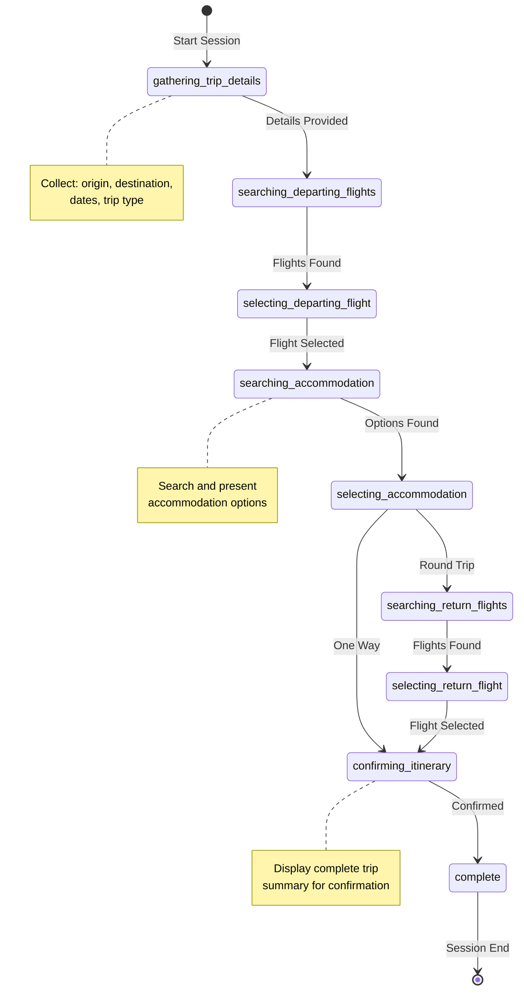

# Travel Assistant Agent

## Implementation: Sherpa

A state-driven agent that demonstrates complex multi-step workflows. The Sherpa agent showcases how to build agents that maintain conversation state, handle user choices, and coordinate multiple tool integrations.

### Why "Sherpa"?

Just as Sherpas are expert guides who help travelers navigate challenging mountain terrain, this agent guides users through the complex journey of travel planning. It handles the heavy lifting of searching, comparing options, and maintaining state throughout the booking process—allowing users to focus on their destination rather than the logistics.

## Overview

What makes this pattern valuable:
- **State-driven workflow** - Tracks progress using JSON state files
- **Two deployment options** - Run with existing Node/Python or let Gola auto-download runtimes
- **Multi-tool coordination** - Integrates multiple MCP servers for different services
- **UI-ready hooks** - Progress reporting for building interfaces on top
- **Session persistence** - Resume interrupted sessions exactly where they left off

Built with GPT-4o-mini, demonstrating that structured workflows work well with smaller, cost-effective models when given clear instructions.

## Architecture Patterns

### State Machine Visualization



### State Machine Design

The agent moves through defined states, each with specific responsibilities:

| Status | Action | Next Status |
|--------|--------|-------------|
| `gathering_trip_details` | Collect origin, destination, dates | `searching_departing_flights` |
| `searching_departing_flights` | Search flights, present options | `selecting_departing_flight` |
| `selecting_departing_flight` | User selects flight | `searching_accommodation` |
| `searching_accommodation` | Search accommodations | `selecting_accommodation` |
| `selecting_accommodation` | User selects property | `searching_return_flights` or `confirming_itinerary` |
| `searching_return_flights` | Search return flights | `selecting_return_flight` |
| `selecting_return_flight` | User selects return | `confirming_itinerary` |
| `confirming_itinerary` | Show complete itinerary | `complete` |
| `complete` | Session finished | New session |

### State Persistence Structure

Each session maintains its state in a JSON file:

```json
{
  "session_id": "session_1754383691",
  "current_date": "2025-08-04",
  "status": "gathering_trip_details",
  "origin": null,
  "destination": null,
  "dates": {
    "departure": null,
    "return": null
  },
  "travelers": {
    "adults": 1
  },
  "conversation_summary": ""
}
```

### Progress Reporting Hooks

The agent uses specific status codes to control flow:

**Stop and Wait** (Agent pauses for user):
- `"awaiting_input"` - Need trip details
- `"pending_choice"` - User needs to pick something
- `"need_clarification"` - Ambiguous input needs resolution

**Keep Going** (Agent continues automatically):
- `"response_complete"` - Information provided
- `"results_displayed"` - Showing results before asking for choice

## Key Implementation Patterns

### Session Management
1. **Initialization**: Unix timestamps for unique session IDs
2. **State Persistence**: JSON files for state (no database needed)
3. **Progress Tracking**: Hook points for UI integration
4. **Completion**: Clean session teardown and reset

### Input Handling
- **Smart Conversion**: City names to airport codes
- **Ambiguity Resolution**: Handles multiple airports per city
- **Validation**: Ensures valid codes before API calls

### Error Recovery
- **Loop Detection**: Prevents stuck state repetition
- **API Failure Handling**: Graceful degradation after retries
- **State Recovery**: Resume from any interruption point
- **Clear Error Messages**: User-friendly failure explanations

## Prompt Engineering Insights

Critical rules that make the workflow reliable:

1. **Always include both `path` and `content` when writing files** - Prevents filesystem tool errors
2. **Never show raw JSON to users** - Maintain conversational interface
3. **Call progress hooks immediately after questions** - Enables UI updates
4. **Stop after awaiting states** - Allows user response time
5. **Display information before progress reporting** - Prevents blank screens
6. **Reset sessions after completion** - Clean slate for next interaction

## Deployment Approaches

### Two Configuration Modes

1. **Host Environment Mode**: Uses system-installed Node.js and Python
2. **Local Environment Mode**: Gola auto-downloads required runtimes

### Container Deployment

The agent works well in containers using the auto-download approach:
- Minimal base image (Alpine)
- No runtime pre-installation needed
- Gola handles dependencies on first run

## Extension Possibilities

The architecture supports easy additions:

- **Additional Services**: Add more MCP servers for hotels, cars, restaurants
- **Multi-City Support**: Extend state machine for intermediate stops
- **Group Bookings**: Enhance state to track multiple travelers
- **Price Optimization**: Add flexible date searching
- **Notifications**: Integrate notification services for booking confirmations

## Full Implementation

For the complete working example including:
- Full YAML configurations for both deployment modes
- Complete prompt templates and fragments
- MCP server setup details
- Example conversations and outputs

**→ See the [Gola Sherpa Agent repository](https://github.com/gola-agent/gola-sherpa-agent)**

> **Note:** This is an educational example demonstrating complex agent workflows and state management patterns. The repository includes important disclaimers about third-party service integration. Please review the repository README for implementation details and usage guidelines.

## Configuration Tips

- **Model Selection**: GPT-4o-mini works well for structured workflows
- **Token Limits**: Set `max_tokens` to 8000+ for displaying multiple options
- **Temperature**: Use 0.0 for deterministic workflows, 0.7 for more natural conversation
- **MCP Token Limits**: Configure per-server limits to prevent overwhelming responses

## Lessons Learned

- **State machines in prompts work** - Clear state definitions prevent agent confusion
- **Smaller models are sufficient** - Structure matters more than model size
- **Session persistence is crucial** - Users expect to resume interrupted workflows
- **Progress hooks enable real UIs** - Simple status codes bridge agent and interface
- **Explicit rules prevent edge cases** - Tell the agent exactly what NOT to do