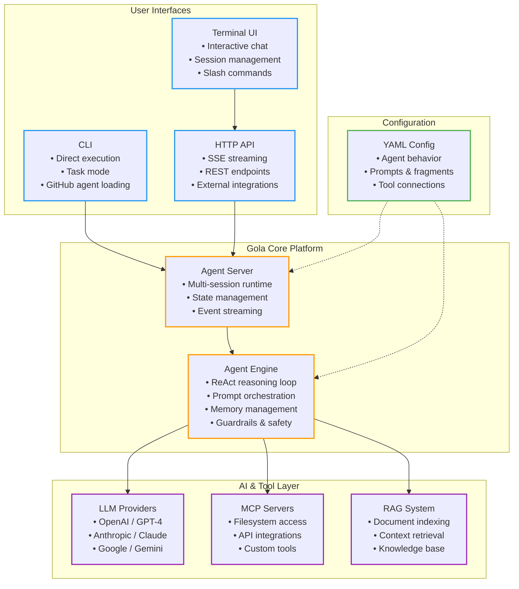

# What is Gola?

Gola lets you build AI agents with YAML, not code. Write a config file, define your prompts, connect some tools, and you've got an agent. Everything ships as a single binary—no Python environments, no npm installs.

## Core Concepts

### AI Agent Platform
Your agent is defined by a YAML file that controls:
- **Agent behavior** - How it thinks, what it remembers, how it handles errors
- **LLM integration** - Which model to use and how to talk to it
- **Prompt engineering** - Build complex prompts from reusable pieces
- **Tool integration** - Give it access to files, APIs, databases—anything that speaks MCP
- **Knowledge bases** - Feed it documents with RAG (if you need that)

### Terminal Interface
Gola comes with a built-in terminal UI that actually works:
- **Session management** - Pick up conversations where you left off
- **Slash commands** - `/model` to switch models mid-conversation, `/copy` to grab code blocks
- **Code block editing** - Append or replace code without copy-pasting
- **Editor integration** - Hooks into Neovim, or just use the clipboard
- **Looks good** - Syntax highlighting that doesn't hurt your eyes

### MCP Integration
MCP (Model Context Protocol) is how your agent talks to the outside world:
- **External tools** - Git, files, web search, databases—if it has an MCP server, you can use it
- **Service orchestration** - Your agent can use multiple tools in one workflow
- **Runtime management** - Gola downloads Python/Node/Bun automatically if needed
- **Security** - Control what tools can do with authorization rules

## Architecture



## Key Features

### Configuration Over Code
No programming required. Just write YAML:

```yaml
agent:
  name: "Development Assistant"
  max_steps: 10
  behavior:
    memory:
      eviction-strategy: summarize
      max-history-steps: 1000
    continue_on_error: true

llm:
  provider: openai
  model: "gpt-4o"
  auth:
    api_key_env: "OPENAI_API_KEY"
```

### Rich Prompt System
Build prompts like you build software—modular and reusable:

```yaml
prompts:
  fragments:
    coding_rules: "prompts/fragments/coding_rules.md"
    project_context: "prompts/fragments/project_context.md"
  roles:
    system:
      - file: "prompts/system/main.md"
      - fragment: "coding_rules"
      - fragment: "project_context"
```

### Tool Integration
Hook up any MCP server with a few lines:

```yaml
mcp_servers:
  - name: "git"
    command:
      command: "uvx"
      args: ["mcp-server-git"]
  - name: "filesystem"
    command:
      command: "npx"
      args: ["-y", "@modelcontextprotocol/server-filesystem", "/workspace"]
```

### State Management
For complex workflows, track state in JSON:

```yaml
# Example from Sherpa travel agent
{
  "session_id": "456",
  "status": "departing_flight_search_required",
  "origin": "SFO",
  "destination": "CDG", 
  "departure_date": "2025-03-10",
  "travelers": {"adults": 1}
}
```

## Getting Started

Want to try it? See the [Getting Started](/getting-started/) guide.