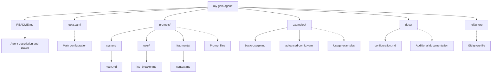
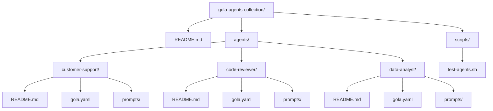

# Publishing on GitHub

This guide covers how to publish and share your Gola agents on GitHub, making them discoverable and reusable by the community.

## Repository Structure

### Single Agent Repository

Create a clear structure for your Gola agent:



### Multi-Agent Repository

For repositories with multiple agents:



## Repository Documentation

### README.md Template

Create a comprehensive README for your agent:

```markdown
# Agent Name

Brief description of what your agent does and its main use cases.

## Features

- Feature 1 - Brief description
- Feature 2 - Brief description  
- Feature 3 - Brief description

## Prerequisites

- **Gola binary** - Download from [releases](https://github.com/gola-agent/gola/releases/latest)
- **API Keys** - OpenAI, Anthropic, or Google Gemini
- **Additional requirements** - List any specific requirements

## Quick Start

```bash
# Clone the repository
git clone https://github.com/username/agent-name.git
cd agent-name

# Set your API key
export OPENAI_API_KEY="your-api-key"

# Run the agent
gola --config gola.yaml
```

## Configuration

Brief explanation of key configuration options:

```yaml
agent:
  name: "Your Agent"
  description: "What it does"

llm:
  provider: openai
  model: "gpt-4o-mini"

# Highlight important or customizable sections
```

## Usage Examples

### Basic Usage

```bash
gola --config gola.yaml --task "Example query"
```


## Customization

Explain how users can customize the agent:

- Modify prompts in `prompts/` directory
- Adjust configuration in `gola.yaml`
- Add custom tools or MCP servers

## Discoverability

Make your agent easy to find and use:

### Repository Topics

Add relevant GitHub topics to your repository:

- gola
- ai-agent
- llm
- mcp
- yaml-config
- Domain-specific tags (e.g., data-analysis, code-review, customer-support)

### Clear Naming

Use descriptive repository names:

- gola-data-analyst - Clear purpose
- customer-support-agent - Specific use case
- gola-code-reviewer - Tool and function

### Documentation Quality

Ensure your README includes:

- Clear description of agent purpose
- Working examples with expected outputs
- Prerequisites and setup instructions
- Customization guidelines